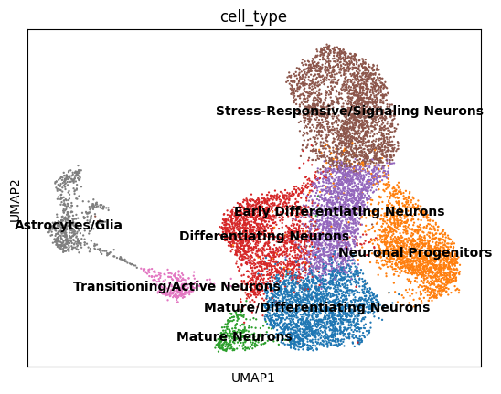

# Team 1 COMP 7980 Capstone Fall 2024

This repository contains the code for the Team 1 Capstone Project, "Comparing Gene Regulatory Network Construction Methods for hiPSC 4R Taupathy Model scRNA-seq Data."

The Jupyter Notebook, `updated_pipeline.ipynb` contains the exploratory data analysis in scanpy, data preprocessing, Cell Marker annotation in scanpy, Pearson correlation coefficient gene regulatory network creation, and node2vec gene regulatory network creation. The python file `grn_n2v.py` defines supporting methods that are used in the Jupyter notebook.

Due to the memory constraints of Jupyter Notebooks, the variational graph autoencoder gene regulatory network was constructed using `memory_control_vgae_script.py` rather than a Jupyter notebook.

Finally, the statistical analysis of the networks is performed using the `network_metrics.py` script.

To run these scripts, you will need the raw data. To get this data as well as the saved network embeddings, please contact the authors.

Based on the initial examination of the notebook's content, I will create a detailed `README.md` file to document the functions, their purposes, and usage, as well as any workflow-specific steps described in the code.

Here is the draft documentation:

---

# README

## updated_pipeline.ipynb

This notebook provides a pipeline for analyzing single-cell and network-based biological data. The main goals are:

1. To preprocess and normalize raw biological datasets.
2. To identify and annotate cell types using statistical markers.
3. To model gene regulatory networks (GRNs) or other biological relationships using graph-based methods.
4. To perform downstream analyses such as clustering, dimensionality reduction, and visualization for biological interpretation.

The pipeline is particularly suited for analyzing single-cell RNA-sequencing (scRNA-seq) data, gene regulatory networks, and other high-dimensional biological datasets.

---

## Requirements

The notebook utilizes the following libraries:

- **scanpy**: Single-cell analysis, preprocessing, and visualization.
- **networkx**: Building and analyzing biological graphs such as GRNs.
- **node2vec**: Graph embedding for representing complex relationships in biological networks.
- **scikit-learn**: Dimensionality reduction and clustering.
- **torch-geometric**: Advanced graph-based machine learning models like VGAE for GRNs.
- **gseapy**: Gene Set Enrichment Analysis to interpret biological functions.

---

## Biological Context

### Why Perform These Steps?

1. **Data Loading and Preprocessing**:

   - **Goal**: Single-cell data often contains technical noise and batch effects due to experimental variability. Preprocessing ensures the data is normalized and suitable for downstream analysis.
   - **Biological Insight**: Accurate preprocessing enables meaningful comparisons between different conditions (e.g., healthy vs. diseased samples).

2. **Cell Type Annotation**:

   - **Goal**: Assign cell types based on marker genes using statistical approaches.
   - **Biological Insight**: Understanding cell types helps identify biological pathways and interactions specific to certain cell populations, critical for studies in immunology, cancer, and developmental biology.

3. **Graph-Based Learning**:

   - **Goal**: Gene Regulatory Networks (GRNs) represent relationships between genes (e.g., co-expression or causal links). Graph-based learning uncovers these interactions.
   - **Biological Insight**: GRNs reveal how genes work together to drive cell behavior and can highlight key regulators in diseases like cancer or Alzheimer's.

4. **Dimensionality Reduction and Clustering**:

   - **Goal**: High-dimensional biological data (e.g., gene expression profiles) needs to be reduced into interpretable dimensions for clustering and visualization.
   - **Biological Insight**: Identifying clusters corresponds to discovering distinct biological states, cell types, or disease subtypes.

5. **Visualization**:
   - **Goal**: Generate clear visual representations of data for biological interpretation and hypothesis generation.
   - **Biological Insight**: Visualization helps to identify patterns such as cell populations or relationships between samples.

---

## Workflow

### Step 1: Data Loading and Preprocessing

The `load_and_preprocess_data` function loads raw datasets (e.g., single-cell gene expression data) and applies preprocessing steps such as:

- Normalization
- Batch effect correction
- Filtering of low-quality data

**Example:**

```python
data = load_and_preprocess_data(
    [control_filepath, group2_filepath, group3_filepath],
    batch_labels=["control", "treatment1", "treatment2"]
)
```

**Biological Context**: Preprocessing ensures the data is comparable across experimental conditions, addressing technical variability.

---

### Step 2: Cell Type Annotation

The `cell_type_annotation` function uses statistical markers (e.g., specific genes expressed by a cell type) to assign cell type identities to clusters.

**Parameters**:

- `data`: Preprocessed data.
- `marker_filepath`: Path to a CSV file containing statistical markers.

**Example:**

```python
control_data, group2_data, group3_data = cell_type_annotation(data, "./statistical_cell_markers.csv")
```

**Biological Context**: This step is crucial for downstream analyses, as identifying cell types helps uncover biological processes like immune responses or developmental pathways.

---

### Step 3: Graph-Based Learning

Using tools like Node2Vec and VGAE, the pipeline models relationships in biological data as a graph. For example:

- Nodes represent genes or cells.
- Edges represent interactions, such as co-expression or physical binding.

**Example:**

```python
# Define and train a VGAE model
model = VGAE(encoder=GCNConv(input_dim, hidden_dim))
model.train(data)
```

**Biological Context**: Graph models allow the discovery of hubs (e.g., master regulators) or communities (e.g., co-regulated gene sets), which are pivotal in understanding complex diseases.

---

### Step 4: Dimensionality Reduction and Clustering

Techniques such as PCA and t-SNE reduce the dimensionality of gene expression data while preserving key structures. Clustering methods (e.g., k-means) group similar data points together.

**Example:**

```python
pca = PCA(n_components=50).fit_transform(data)
clusters = KMeans(n_clusters=3).fit_predict(pca)
```

**Biological Context**: Clusters can correspond to cell types, disease states, or experimental conditions, providing insights into biological heterogeneity.

---

### Step 5: Visualization

Visualization tools such as heatmaps, scatter plots, and clustering plots are used to interpret the data.

**Example:**

```python
sns.clustermap(cluster_data)
plt.show()
```

**Biological Context**: Visualization helps identify patterns, such as which genes are uniquely expressed in a cluster or how conditions differ.

---

## Function Reference

| Function Name              | Description                                                                                         | Biological Purpose                                                               |
| -------------------------- | --------------------------------------------------------------------------------------------------- | -------------------------------------------------------------------------------- |
| `load_and_preprocess_data` | Loads and preprocesses raw data, applies batch normalization, and filters low-quality samples.      | Ensures clean and comparable datasets for meaningful analysis.                   |
| `cell_type_annotation`     | Annotates cell types based on marker genes using statistical analysis.                              | Identifies biologically relevant populations in the dataset.                     |
| `train_graph_model`        | Trains a graph-based machine learning model (e.g., VGAE) to learn interactions between genes/cells. | Reveals regulatory relationships or functional groupings in biological networks. |
| `visualize_clusters`       | Visualizes clusters using scatter plots or heatmaps.                                                | Identifies distinct cell populations or experimental conditions.                 |

---

## Pickling Processed Data

To save computational results for future use, you can serialize objects using `pickle`.

**Example:**

```python
with open('control_data.pickle', 'wb') as f:
    pickle.dump(control_data, f)
```

---

## Conclusion

This pipeline provides a comprehensive framework for single-cell and network-based data analysis, integrating preprocessing, clustering, graph learning, and visualization.

---

Here is a detailed `README.md` documentation for the `grn_n2v.py` script. It provides explanations for each function, its purpose, and the biological context.

---

# grn_n2v.py

The `grn_n2v.py` script is designed for analyzing single-cell gene expression data and constructing gene regulatory networks (GRNs) using graph-based machine learning techniques. The script includes steps for data preprocessing, GRN construction, embedding generation, clustering, and biological interpretation. It is suitable for applications in systems biology and bioinformatics.

## Requirements

### Python Libraries

The script requires the following Python packages:

- **scanpy**: For single-cell data analysis.
- **pandas** and **numpy**: For data manipulation and numerical computations.
- **networkx**: For graph construction and analysis.
- **node2vec**: For generating graph embeddings.
- **matplotlib** and **seaborn**: For visualization.
- **scikit-learn**: For clustering and dimensionality reduction.
- **statsmodels**: For statistical tests and multiple testing correction.
- **tqdm**: For progress visualization.

---

## Workflow

### 1. Data Preprocessing

**Function**: `load_and_preprocess_data`

- **Purpose**: Loads raw gene expression data from `.mtx` files, performs quality control (QC), normalization, and feature selection.
- **Biological Context**: QC removes low-quality cells/genes, normalization accounts for differences in sequencing depth, and feature selection identifies highly variable genes for analysis.

**Key Steps**:

- Identifies mitochondrial, ribosomal, and hemoglobin genes for filtering.
- Normalizes and log-transforms the data.
- Selects 2,000 highly variable genes for analysis.

**Example**:

```python
adata = load_and_preprocess_data(
    [control_filepath, group2_filepath, group3_filepath],
    batch_labels=["control", "treatment1", "treatment2"]
)
```

---

### 2. Cell Type Annotation

**Function**: `cell_type_annotation`

- **Purpose**: Assigns cell types to clusters based on marker genes.
- **Biological Context**: Identifies distinct cell populations such as progenitors, mature neurons, or glial cells, which are critical for understanding tissue-specific or disease-specific processes.

**Key Steps**:

- Performs clustering using Leiden algorithm.
- Matches clusters to known neuronal marker genes.
- Visualizes marker expression on UMAP plots.

**Example**:

```python
control_data, group2_data, group3_data = cell_type_annotation(adata, "./markers.csv")
```

---

### 3. GRN Construction

**Function**: `construct_grn`

- **Purpose**: Constructs a gene regulatory network (GRN) based on gene co-expression.
- **Biological Context**: GRNs reveal gene-gene interactions, which are crucial for understanding regulatory mechanisms in biology.

**Key Steps**:

- Computes a correlation matrix from gene expression data.
- Filters edges based on a correlation threshold.
- Constructs a graph where nodes are genes and edges represent correlations.

**Example**:

```python
G = construct_grn(adata, threshold=0.5)
```

---

### 4. Node2Vec Embedding

**Function**: `apply_node2vec`

- **Purpose**: Generates low-dimensional embeddings for nodes (genes) in the GRN.
- **Biological Context**: Embeddings capture structural information about gene connectivity, enabling downstream tasks like clustering or regulatory prediction.

**Example**:

```python
embeddings = apply_node2vec(G)
```

---

### 5. Visualization

**Function**: `visualize`

- **Purpose**: Visualizes the GRN using 2D embeddings (PCA).
- **Biological Context**: Enables interpretation of network structure and relationships between genes.

**Example**:

```python
visualize(embeddings, G)
```

---

### 6. Clustering

**Function**: `cluster`

- **Purpose**: Identifies gene clusters based on graph embeddings.
- **Biological Context**: Gene clusters often represent co-regulated or functionally related groups, providing insights into biological pathways.

**Example**:

```python
clusters = cluster(embeddings, G)
```

---

### 7. Gene Set Enrichment Analysis (GSEA)

**Function**: `gsea`

- **Purpose**: Identifies enriched pathways or biological processes within gene clusters.
- **Biological Context**: GSEA highlights key biological functions or pathways associated with specific gene clusters.

**Example**:

```python
gsea_results = gsea(G, clusters)
```

---

### 8. Predict Regulatory Relationships

**Function**: `predict_regulatory_relationships`

- **Purpose**: Predicts novel gene-gene interactions based on similarity in graph embeddings.
- **Biological Context**: Helps identify potential regulatory relationships not directly observed in the data.

**Example**:

```python
predict_regulatory_relationships(G, embeddings)
```

---

### 9. Differential Expression Analysis

**Function**: `ANOVA`

- **Purpose**: Identifies dimensions in the graph embeddings that are significantly different between conditions.
- **Biological Context**: Highlights genes or pathways that are differentially active between experimental groups.

**Example**:

```python
significant_dims = ANOVA(control_embeddings, treatment1_embeddings, treatment2_embeddings)
```

---

### 10. Network Metrics

**Function**: `calculate_network_metrics`

- **Purpose**: Computes global metrics of the GRN, such as average degree, clustering coefficient, and density.
- **Biological Context**: Provides a summary of the overall structure and connectivity of the GRN.

**Example**:

```python
metrics = calculate_network_metrics(G)
```

---

## Conclusion

The `grn_n2v.py` script provides a comprehensive framework for constructing and analyzing gene regulatory networks from single-cell data. By integrating preprocessing, GRN construction, embedding generation, and clustering, this script facilitates the discovery of regulatory mechanisms and biologically meaningful patterns.

---

Here is the detailed `README.md` for the `vgae.py` script, which documents each function, its purpose, and the biological context.

---

Here is the detailed `README.md` for the `memory_control_vgae_script.py` script, documenting its functionality, purpose, and biological context.

---

# memory_control_vgae_script.py

The `memory_control_vgae_script.py` script implements a Variational Graph Autoencoder (VGAE) with efficient memory management for analyzing gene regulatory networks (GRNs). It constructs sparse adjacency matrices, trains VGAE models, and evaluates reconstructed GRNs across multiple experimental groups. The script focuses on scalability and efficient handling of large-scale biological data.

---

## Requirements

### Python Libraries

The script uses the following Python libraries:

- **torch**: For implementing neural networks.
- **torch_geometric**: For graph-based machine learning.
- **numpy**: For numerical computations.
- **networkx**: For graph operations.
- **scipy**: For sparse matrix handling.
- **scikit-learn**: For preprocessing and similarity computations.
- **matplotlib**: For visualizations.

---

## Workflow

### 1. Graph Convolutional Encoder

**Class**: `GCNEncoder`

- **Purpose**: A custom encoder for the VGAE that utilizes multiple Graph Convolutional Network (GCN) layers to encode graph structure into a latent space.
- **Biological Context**: Encodes high-dimensional gene expression data while preserving the relationships between genes.

**Key Methods**:

1. **`forward`**:

   - Processes input features through GCN layers.
   - Outputs mean (`mu`) and log standard deviation (`logstd`) for the latent space.

   ```python
   def forward(self, x, edge_index):
       x1 = self.conv1(x, edge_index).relu()
       x2 = self.conv2(x1, edge_index).relu()
       mu = self.conv_mu(x2, edge_index)
       logstd = self.conv_logstd(x2, edge_index)
       return mu, logstd
   ```

2. **`build_adjacency_matrix`**:
   - Constructs a sparse adjacency matrix based on a correlation threshold.
   - **Biological Context**: Represents co-expression relationships between genes in the dataset.

---

### 2. VGAE Training

**Function**: `train_vgae`

- **Purpose**: Trains the VGAE model to encode gene expression data and reconstruct the graph.
- **Biological Context**: Learns latent representations of genes while optimizing reconstruction accuracy and regularizing via KL divergence.

**Key Steps**:

- Encodes node features and computes reconstruction and KL divergence losses.
- Trains the model using gradient descent.
- Includes a custom reconstruction loss for better interpretability.

**Example**:

```python
model, z = train_vgae(data, model, beta=275, epochs=150, lr=0.001)
```

---

### 3. Memory-Efficient Adjacency Matrix Construction

**Functions**:

1. **`create_sparse_adjacency`**:

   - Constructs a sparse adjacency matrix for large graphs using an Erdos-Renyi random graph generator.
   - **Biological Context**: Simulates graph structures for testing and memory efficiency.

2. **`build_sparse_adjacency_from_embeddings`**:
   - Constructs a sparse adjacency matrix from embeddings using cosine similarity.
   - **Biological Context**: Identifies gene relationships based on similarity in latent space.

---

### 4. Custom Loss Functions

**Functions**:

1. **`custom_recon_loss`**:

   - Computes reconstruction loss using binary cross-entropy, comparing reconstructed adjacency matrices to ground truth.
   - **Biological Context**: Ensures that reconstructed GRNs accurately reflect the underlying gene relationships.

2. **`weighted_recon_loss`**:
   - Incorporates edge weights into the reconstruction loss for better granularity.
   - **Biological Context**: Captures the varying strengths of gene-gene interactions.

---

### 5. Visualization

**Function**: `visualize_reconstructed_adjacency_matrix`

- **Purpose**: Visualizes the distribution of edge weights in the reconstructed adjacency matrix.
- **Biological Context**: Assesses the quality of GRN reconstruction and identifies key interactions.

**Example**:

```python
visualize_reconstructed_adjacency_matrix(reconstructed_adjacency.detach().cpu().numpy(), "control")
```

---

### 6. Main Pipeline

The script processes data for three experimental groups (control, treatment group 1, and treatment group 2) through the following steps:

1. **Data Loading**:
   - Loads preprocessed data from `.pickle` files.
   - Prepares features and adjacency matrices.
2. **VGAE Training**:
   - Trains VGAE models for each group to learn latent embeddings.
3. **Evaluation**:
   - Reconstructs adjacency matrices for each group.
4. **Visualization and Embedding Storage**:
   - Saves embeddings and reconstructed adjacency matrices for downstream analysis.

**Example**:

```python
data = Data(x=control_embeddings_list, edge_index=edge_index)
model, z = train_vgae(data, model, beta=275, epochs=150, lr=0.001)
reconstructed_adjacency = GCNEncoder.evaluate_vgae(model, data)
np.save("control_reconstructed_adjacency_matrix.npy", reconstructed_adjacency.cpu().detach().numpy())
```

---

## Function Reference

| Function/Method                            | Description                                                     | Biological Purpose                                 |
| ------------------------------------------ | --------------------------------------------------------------- | -------------------------------------------------- |
| `GCNEncoder`                               | Implements the GCN-based encoder for VGAE.                      | Captures latent structure of GRNs.                 |
| `build_adjacency_matrix`                   | Constructs adjacency matrix from gene expression data.          | Represents co-expression relationships as a graph. |
| `train_vgae`                               | Trains VGAE with reconstruction and KL divergence loss.         | Learns a compact representation of GRNs.           |
| `custom_recon_loss`                        | Computes custom reconstruction loss using binary cross-entropy. | Improves adjacency reconstruction accuracy.        |
| `weighted_recon_loss`                      | Incorporates edge weights into reconstruction loss.             | Captures varying strengths of gene interactions.   |
| `visualize_reconstructed_adjacency_matrix` | Visualizes the reconstructed adjacency matrix.                  | Evaluates GRN reconstruction quality.              |

---

## Biological Context

### Why Memory-Efficient VGAE for GRNs?

- Gene Regulatory Networks (GRNs) are often large and sparse, making efficient memory handling critical for scalability.
- Variational Graph Autoencoders (VGAEs) provide a latent representation of these networks, enabling tasks like clustering and prediction of regulatory interactions.

### Applications:

1. **Regulatory Network Reconstruction**: Infers potential regulatory relationships from gene expression data.
2. **Gene Clustering**: Groups genes based on latent embeddings to identify co-regulated modules.
3. **Differential Network Analysis**: Compares GRNs across experimental conditions to identify condition-specific interactions.

---

## Conclusion

The `memory_control_vgae_script.py` script is a scalable solution for analyzing large-scale GRNs using VGAE. Its memory-efficient adjacency matrix construction, customizable loss functions, and comprehensive evaluation pipeline make it suitable for advanced bioinformatics applications.

---

## Reconstructed Adjacency Matrix Analysis

### Results

These histograms visualize the distribution of reconstructed edge weights in the adjacency matrices for three different experimental groups:

1. **Control Group**
2. **Treatment Group 1**
3. **Treatment Group 2**

The edge weights represent the similarity or strength of relationships between nodes (genes) as inferred by the Variational Graph Autoencoder (VGAE).

---

## UMAP Visualization of Cell Types



### Description

This UMAP plot visualizes clusters of cells based on their gene expression profiles, with each cluster annotated by its **cell type**. The annotations are derived using well-known marker genes and statistical cell type markers.

### Key Observations:

1. **Astrocytes/Glia** (grey cluster):

   - Represent support cells in the brain, crucial for maintaining neuronal function and homeostasis.

2. **Neuronal Progenitors** (orange cluster):

   - Early-stage neuronal cells that can differentiate into mature neurons.

3. **Mature Neurons** (green cluster):

   - Fully differentiated neurons responsible for neuronal activity and signaling.

4. **Mature/Differentiating Neurons** (blue cluster):

   - Intermediate state between progenitors and mature neurons.

5. **Transitioning/Active Neurons** (purple cluster):

   - Cells undergoing active transcriptional changes as part of their transition.

6. **Differentiating Neurons** and **Early Differentiating Neurons** (red clusters):

   - Neuronal cells at earlier stages of differentiation.

7. **Stress-Responsive/Signaling Neurons** (brown cluster):
   - Neurons responding to stress or exhibiting enhanced signaling pathways.

### Biological Context

This visualization highlights the heterogeneity of neuronal populations and glial cells within the dataset. By clustering cells based on gene expression and annotating them with specific types, we gain insights into:

- Developmental pathways of neurons.
- Cellular responses to stress or treatment.
- Identification of critical cell populations for downstream analysis (e.g., disease markers, regulatory patterns).

---
