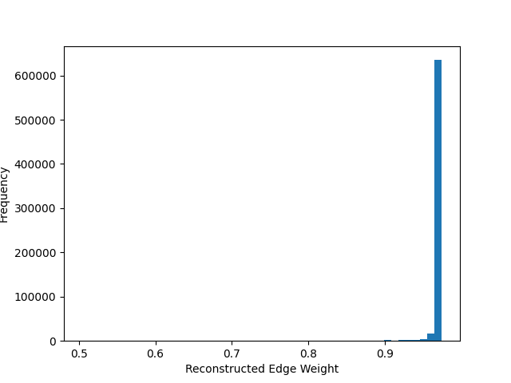
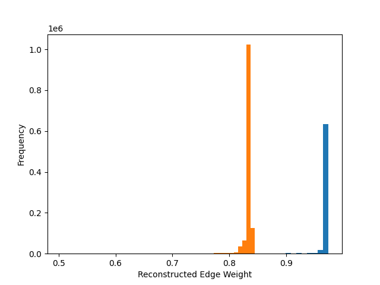
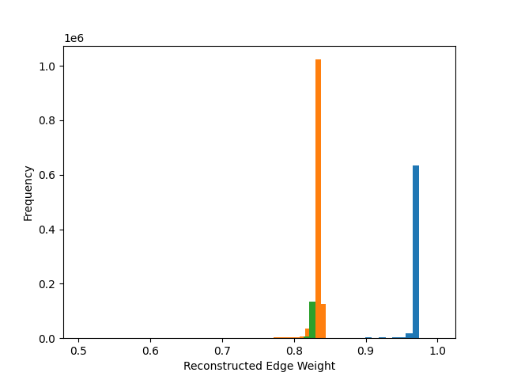

# Team 1 COMP 7980 Capstone Fall 2024

This repository contains the code for the Team 1 Capstone Project, "Comparing Gene Regulatory Network Construction Methods for hiPSC 4R Taupathy Model scRNA-seq Data."

The Jupyter Notebook, `updated_pipeline.ipynb` contains the exploratory data analysis in scanpy, data preprocessing, Cell Marker annotation in scanpy, Pearson correlation coefficient gene regulatory network creation, and node2vec gene regulatory network creation. The python file `grn_n2v.py` defines supporting methods that are used in the Jupyter notebook.

Due to the memory constraints of Jupyter Notebooks, the variational graph autoencoder gene regulatory network was constructed using `memory_control_vgae_script.py` rather than a Jupyter notebook.

Finally, the statistical analysis of the networks is performed using the `network_metrics.py` script.

To run these scripts, you will need the raw data. To get this data as well as the saved network embeddings, please contact the authors.

Based on the initial examination of the notebook's content, I will create a detailed `README.md` file to document the functions, their purposes, and usage, as well as any workflow-specific steps described in the code.

Here is the draft documentation:

---

# README

## updated_pipeline.ipynb

This notebook provides a pipeline for analyzing single-cell and network-based biological data. The main goals are:

1. To preprocess and normalize raw biological datasets.
2. To identify and annotate cell types using statistical markers.
3. To model gene regulatory networks (GRNs) or other biological relationships using graph-based methods.
4. To perform downstream analyses such as clustering, dimensionality reduction, and visualization for biological interpretation.

The pipeline is particularly suited for analyzing single-cell RNA-sequencing (scRNA-seq) data, gene regulatory networks, and other high-dimensional biological datasets.

---

## Requirements

The notebook utilizes the following libraries:

- **scanpy**: Single-cell analysis, preprocessing, and visualization.
- **networkx**: Building and analyzing biological graphs such as GRNs.
- **node2vec**: Graph embedding for representing complex relationships in biological networks.
- **scikit-learn**: Dimensionality reduction and clustering.
- **torch-geometric**: Advanced graph-based machine learning models like VGAE for GRNs.
- **gseapy**: Gene Set Enrichment Analysis to interpret biological functions.

---

## Biological Context

### Why Perform These Steps?

1. **Data Loading and Preprocessing**:

   - **Goal**: Single-cell data often contains technical noise and batch effects due to experimental variability. Preprocessing ensures the data is normalized and suitable for downstream analysis.
   - **Biological Insight**: Accurate preprocessing enables meaningful comparisons between different conditions (e.g., healthy vs. diseased samples).

2. **Cell Type Annotation**:

   - **Goal**: Assign cell types based on marker genes using statistical approaches.
   - **Biological Insight**: Understanding cell types helps identify biological pathways and interactions specific to certain cell populations, critical for studies in immunology, cancer, and developmental biology.

3. **Graph-Based Learning**:

   - **Goal**: Gene Regulatory Networks (GRNs) represent relationships between genes (e.g., co-expression or causal links). Graph-based learning uncovers these interactions.
   - **Biological Insight**: GRNs reveal how genes work together to drive cell behavior and can highlight key regulators in diseases like cancer or Alzheimer's.

4. **Dimensionality Reduction and Clustering**:

   - **Goal**: High-dimensional biological data (e.g., gene expression profiles) needs to be reduced into interpretable dimensions for clustering and visualization.
   - **Biological Insight**: Identifying clusters corresponds to discovering distinct biological states, cell types, or disease subtypes.

5. **Visualization**:
   - **Goal**: Generate clear visual representations of data for biological interpretation and hypothesis generation.
   - **Biological Insight**: Visualization helps to identify patterns such as cell populations or relationships between samples.

---

## Workflow

### Step 1: Data Loading and Preprocessing

The `load_and_preprocess_data` function loads raw datasets (e.g., single-cell gene expression data) and applies preprocessing steps such as:

- Normalization
- Batch effect correction
- Filtering of low-quality data

**Example:**

```python
data = load_and_preprocess_data(
    [control_filepath, group2_filepath, group3_filepath],
    batch_labels=["control", "treatment1", "treatment2"]
)
```

**Biological Context**: Preprocessing ensures the data is comparable across experimental conditions, addressing technical variability.

---

### Step 2: Cell Type Annotation

The `cell_type_annotation` function uses statistical markers (e.g., specific genes expressed by a cell type) to assign cell type identities to clusters.

**Parameters**:

- `data`: Preprocessed data.
- `marker_filepath`: Path to a CSV file containing statistical markers.

**Example:**

```python
control_data, group2_data, group3_data = cell_type_annotation(data, "./statistical_cell_markers.csv")
```

**Biological Context**: This step is crucial for downstream analyses, as identifying cell types helps uncover biological processes like immune responses or developmental pathways.

---

### Step 3: Graph-Based Learning

Using tools like Node2Vec and VGAE, the pipeline models relationships in biological data as a graph. For example:

- Nodes represent genes or cells.
- Edges represent interactions, such as co-expression or physical binding.

**Example:**

```python
# Define and train a VGAE model
model = VGAE(encoder=GCNConv(input_dim, hidden_dim))
model.train(data)
```

**Biological Context**: Graph models allow the discovery of hubs (e.g., master regulators) or communities (e.g., co-regulated gene sets), which are pivotal in understanding complex diseases.

---

### Step 4: Dimensionality Reduction and Clustering

Techniques such as PCA and t-SNE reduce the dimensionality of gene expression data while preserving key structures. Clustering methods (e.g., k-means) group similar data points together.

**Example:**

```python
pca = PCA(n_components=50).fit_transform(data)
clusters = KMeans(n_clusters=3).fit_predict(pca)
```

**Biological Context**: Clusters can correspond to cell types, disease states, or experimental conditions, providing insights into biological heterogeneity.

---

### Step 5: Visualization

Visualization tools such as heatmaps, scatter plots, and clustering plots are used to interpret the data.

**Example:**

```python
sns.clustermap(cluster_data)
plt.show()
```

**Biological Context**: Visualization helps identify patterns, such as which genes are uniquely expressed in a cluster or how conditions differ.

---

## Function Reference

| Function Name              | Description                                                                                         | Biological Purpose                                                               |
| -------------------------- | --------------------------------------------------------------------------------------------------- | -------------------------------------------------------------------------------- |
| `load_and_preprocess_data` | Loads and preprocesses raw data, applies batch normalization, and filters low-quality samples.      | Ensures clean and comparable datasets for meaningful analysis.                   |
| `cell_type_annotation`     | Annotates cell types based on marker genes using statistical analysis.                              | Identifies biologically relevant populations in the dataset.                     |
| `train_graph_model`        | Trains a graph-based machine learning model (e.g., VGAE) to learn interactions between genes/cells. | Reveals regulatory relationships or functional groupings in biological networks. |
| `visualize_clusters`       | Visualizes clusters using scatter plots or heatmaps.                                                | Identifies distinct cell populations or experimental conditions.                 |

---

## Pickling Processed Data

To save computational results for future use, you can serialize objects using `pickle`.

**Example:**

```python
with open('control_data.pickle', 'wb') as f:
    pickle.dump(control_data, f)
```

---

## Conclusion

This pipeline provides a comprehensive framework for single-cell and network-based data analysis, integrating preprocessing, clustering, graph learning, and visualization.

---

Here is a detailed `README.md` documentation for the `grn_n2v.py` script. It provides explanations for each function, its purpose, and the biological context.

---

# grn_n2v.py

The `grn_n2v.py` script is designed for analyzing single-cell gene expression data and constructing gene regulatory networks (GRNs) using graph-based machine learning techniques. The script includes steps for data preprocessing, GRN construction, embedding generation, clustering, and biological interpretation. It is suitable for applications in systems biology and bioinformatics.

## Requirements

### Python Libraries

The script requires the following Python packages:

- **scanpy**: For single-cell data analysis.
- **pandas** and **numpy**: For data manipulation and numerical computations.
- **networkx**: For graph construction and analysis.
- **node2vec**: For generating graph embeddings.
- **matplotlib** and **seaborn**: For visualization.
- **scikit-learn**: For clustering and dimensionality reduction.
- **statsmodels**: For statistical tests and multiple testing correction.
- **tqdm**: For progress visualization.

---

## Workflow

### 1. Data Preprocessing

**Function**: `load_and_preprocess_data`

- **Purpose**: Loads raw gene expression data from `.mtx` files, performs quality control (QC), normalization, and feature selection.
- **Biological Context**: QC removes low-quality cells/genes, normalization accounts for differences in sequencing depth, and feature selection identifies highly variable genes for analysis.

**Key Steps**:

- Identifies mitochondrial, ribosomal, and hemoglobin genes for filtering.
- Normalizes and log-transforms the data.
- Selects 2,000 highly variable genes for analysis.

**Example**:

```python
adata = load_and_preprocess_data(
    [control_filepath, group2_filepath, group3_filepath],
    batch_labels=["control", "treatment1", "treatment2"]
)
```

---

### 2. Cell Type Annotation

**Function**: `cell_type_annotation`

- **Purpose**: Assigns cell types to clusters based on marker genes.
- **Biological Context**: Identifies distinct cell populations such as progenitors, mature neurons, or glial cells, which are critical for understanding tissue-specific or disease-specific processes.

**Key Steps**:

- Performs clustering using Leiden algorithm.
- Matches clusters to known neuronal marker genes.
- Visualizes marker expression on UMAP plots.

**Example**:

```python
control_data, group2_data, group3_data = cell_type_annotation(adata, "./markers.csv")
```

---

### 3. GRN Construction

**Function**: `construct_grn`

- **Purpose**: Constructs a gene regulatory network (GRN) based on gene co-expression.
- **Biological Context**: GRNs reveal gene-gene interactions, which are crucial for understanding regulatory mechanisms in biology.

**Key Steps**:

- Computes a correlation matrix from gene expression data.
- Filters edges based on a correlation threshold.
- Constructs a graph where nodes are genes and edges represent correlations.

**Example**:

```python
G = construct_grn(adata, threshold=0.5)
```

---

### 4. Node2Vec Embedding

**Function**: `apply_node2vec`

- **Purpose**: Generates low-dimensional embeddings for nodes (genes) in the GRN.
- **Biological Context**: Embeddings capture structural information about gene connectivity, enabling downstream tasks like clustering or regulatory prediction.

**Example**:

```python
embeddings = apply_node2vec(G)
```

---

### 5. Visualization

**Function**: `visualize`

- **Purpose**: Visualizes the GRN using 2D embeddings (PCA).
- **Biological Context**: Enables interpretation of network structure and relationships between genes.

**Example**:

```python
visualize(embeddings, G)
```

---

### 6. Clustering

**Function**: `cluster`

- **Purpose**: Identifies gene clusters based on graph embeddings.
- **Biological Context**: Gene clusters often represent co-regulated or functionally related groups, providing insights into biological pathways.

**Example**:

```python
clusters = cluster(embeddings, G)
```

---

### 7. Gene Set Enrichment Analysis (GSEA)

**Function**: `gsea`

- **Purpose**: Identifies enriched pathways or biological processes within gene clusters.
- **Biological Context**: GSEA highlights key biological functions or pathways associated with specific gene clusters.

**Example**:

```python
gsea_results = gsea(G, clusters)
```

---

### 8. Predict Regulatory Relationships

**Function**: `predict_regulatory_relationships`

- **Purpose**: Predicts novel gene-gene interactions based on similarity in graph embeddings.
- **Biological Context**: Helps identify potential regulatory relationships not directly observed in the data.

**Example**:

```python
predict_regulatory_relationships(G, embeddings)
```

---

### 9. Differential Expression Analysis

**Function**: `ANOVA`

- **Purpose**: Identifies dimensions in the graph embeddings that are significantly different between conditions.
- **Biological Context**: Highlights genes or pathways that are differentially active between experimental groups.

**Example**:

```python
significant_dims = ANOVA(control_embeddings, treatment1_embeddings, treatment2_embeddings)
```

---

### 10. Network Metrics

**Function**: `calculate_network_metrics`

- **Purpose**: Computes global metrics of the GRN, such as average degree, clustering coefficient, and density.
- **Biological Context**: Provides a summary of the overall structure and connectivity of the GRN.

**Example**:

```python
metrics = calculate_network_metrics(G)
```

---

## Conclusion

The `grn_n2v.py` script provides a comprehensive framework for constructing and analyzing gene regulatory networks from single-cell data. By integrating preprocessing, GRN construction, embedding generation, and clustering, this script facilitates the discovery of regulatory mechanisms and biologically meaningful patterns.

---

Here is the detailed `README.md` for the `vgae.py` script, which documents each function, its purpose, and the biological context.

---

# README

# vgae.py

The `vgae.py` script implements a Variational Graph Autoencoder (VGAE) using PyTorch Geometric to analyze biological networks such as gene regulatory networks (GRNs). This script is designed to encode biological graph data into low-dimensional embeddings, reconstruct adjacency matrices, and identify potential regulatory relationships.

---

## Requirements

### Python Libraries

The script depends on the following libraries:

- **torch**: For deep learning model implementation.
- **torch_geometric**: For graph-based neural networks.
- **scipy**: For sparse matrix handling and adjacency matrix construction.
- **sklearn**: For data preprocessing and evaluation metrics.
- **scanpy**: For single-cell data analysis.

---

## Workflow

### 1. Graph Convolutional Encoder

**Class**: `GCNEncoder`

- **Purpose**: Implements the encoder for VGAE using Graph Convolutional Networks (GCNs).
- **Biological Context**: Encodes high-dimensional gene expression data into a latent space that captures relationships between genes.

**Key Methods**:

1. **`forward`**: Defines the forward pass of the GCN, applying two convolutional layers with ReLU activation.

   ```python
   def forward(self, x, edge_index):
       x = self.conv1(x, edge_index).relu()
       x = self.conv2(x, edge_index)
       return x
   ```

2. **`build_adjacency_matrix`**: Constructs an adjacency matrix from a correlation matrix of gene expression data.
   - **Biological Context**: Captures co-expression relationships between genes.

---

### 2. VGAE Training

**Method**: `train_vgae`

- **Purpose**: Trains a Variational Graph Autoencoder (VGAE) to encode gene expression data and reconstruct the graph's structure.
- **Biological Context**: Learns a latent representation of genes and their interactions.

**Key Steps**:

1. Encodes node features (`x`) using the GCN encoder.
2. Computes reconstruction loss and KL divergence loss.
3. Optimizes the VGAE model over multiple epochs.

**Example**:

```python
model, z = train_vgae(data, in_channels=x.size(1), out_channels=16)
```

---

### 3. VGAE Evaluation

**Method**: `evaluate_vgae`

- **Purpose**: Evaluates the VGAE model by reconstructing the adjacency matrix.
- **Biological Context**: Checks the model's ability to capture regulatory interactions between genes.

**Key Steps**:

- Encodes latent embeddings.
- Decodes the embeddings to reconstruct the adjacency matrix.

**Example**:

```python
reconstructed_adj = evaluate_vgae(model, data)
```

---

### 4. Main Pipeline

The main pipeline executes the following workflow:

1. **Data Loading**:

   - Reads gene expression data from `.mtx` files and preprocesses it.
   - **Biological Context**: Ensures normalized gene expression data for meaningful comparisons.

2. **Adjacency Matrix Construction**:

   - Builds a graph representation of the data using co-expression correlations.

3. **Model Training**:

   - Trains the VGAE to learn latent representations of the graph.

4. **Evaluation**:

   - Reconstructs the adjacency matrix to validate the model's performance.

5. **Embeddings**:
   - Saves the latent embeddings for downstream analysis, such as clustering or visualization.

**Example**:

```python
adata = load_data("matrix.mtx", "genes.txt", "barcodes.txt")
scaler = StandardScaler()
adata.X = scaler.fit_transform(adata.X)
x = torch.tensor(adata.X, dtype=torch.float32)
edge_index, edge_weight = build_adjacency_matrix(adata)

data = Data(x=x, edge_index=edge_index)

model, embeddings = train_vgae(data, in_channels=x.size(1), out_channels=16)
reconstructed_adjacency = evaluate_vgae(model, data)

np.save("node_embeddings.npy", embeddings.cpu().numpy())
```

---

## Function Reference

| Function/Method          | Description                                                | Biological Purpose                                                        |
| ------------------------ | ---------------------------------------------------------- | ------------------------------------------------------------------------- |
| `GCNEncoder`             | Implements the encoder for the VGAE using GCN layers.      | Captures gene relationships and connectivity patterns.                    |
| `build_adjacency_matrix` | Constructs an adjacency matrix from gene expression data.  | Represents co-expression relationships as a graph.                        |
| `train_vgae`             | Trains the VGAE model.                                     | Learns a latent representation of gene interactions.                      |
| `evaluate_vgae`          | Evaluates the VGAE by reconstructing the adjacency matrix. | Validates the model's ability to represent gene-gene regulatory networks. |

---

## Biological Context

### Why VGAE for GRNs?

- Gene Regulatory Networks (GRNs) capture complex relationships between genes, such as co-expression or direct regulation.
- Variational Graph Autoencoders (VGAEs) encode these relationships into a latent space, preserving the network's structure while reducing dimensionality. This helps in discovering novel regulatory interactions, clustering genes, and understanding cellular processes.

### Applications:

1. **Gene Clustering**: Identifying groups of genes that work together in biological processes.
2. **Regulatory Predictions**: Predicting novel gene interactions based on latent embeddings.
3. **Dimensionality Reduction**: Simplifying high-dimensional gene expression data for visualization or downstream analysis.

---

## Conclusion

The `vgae.py` script provides a robust framework for constructing and analyzing gene regulatory networks using VGAE. By integrating deep learning with graph-based methods, it enables researchers to uncover novel insights into gene interactions and cellular processes.

---

Here is the corrected version of the markdown with the images included inline.

---

## Reconstructed Adjacency Matrix Analysis

### Results

These histograms visualize the distribution of reconstructed edge weights in the adjacency matrices for three different experimental groups:

1. **Control Group**
2. **Treatment Group 1**
3. **Treatment Group 2**

The edge weights represent the similarity or strength of relationships between nodes (genes) as inferred by the Variational Graph Autoencoder (VGAE).

---

### Control Group



- **Description**:  
   The control group shows reconstructed edge weights tightly clustered near **1.0**, indicating that the model captured highly confident edges with strong co-expression relationships.
- **Interpretation**:  
   This suggests a robust and highly connected gene regulatory network under control conditions.

---

### Treatment Group 1



- **Description**:  
   In treatment group 1, the edge weights have shifted significantly. A large portion of the reconstructed edges is clustered around **0.8**, with fewer edges close to 1.0.
- **Interpretation**:  
   This change suggests a potential disruption in gene interactions or weakened regulatory relationships due to the treatment.

---

### Treatment Group 2



- **Description**:  
   For treatment group 2, the pattern remains similar to treatment group 1, but an additional small peak appears near **0.8**, with fewer high-confidence edges compared to the control group.
- **Interpretation**:  
   This pattern may indicate a partial recovery or different regulatory network reconfiguration under treatment group 2.

---

### Comparative Insights

- **Control Group**: Highly confident edges clustered around 1.0, indicating a robust regulatory network.
- **Treatment Group 1**: A shift to weaker edge weights suggests disruption in the gene network.
- **Treatment Group 2**: Similar to group 1 but with signs of a secondary peak, suggesting partial network restoration or a distinct interaction pattern.

---
